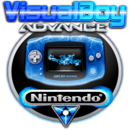
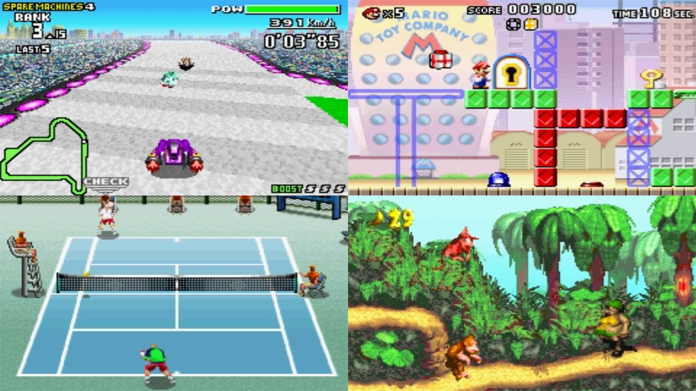

# Nintendo - Game Boy Advance (VBA Next)

### Description

VBA-Next is a fork from the now inactive VisualBoy Advance project, with goals to improve the compatibility and features of the emulator.

### License

GPLv2

### Icon

### Fanart

Help make me fanart!

### Screenshots

